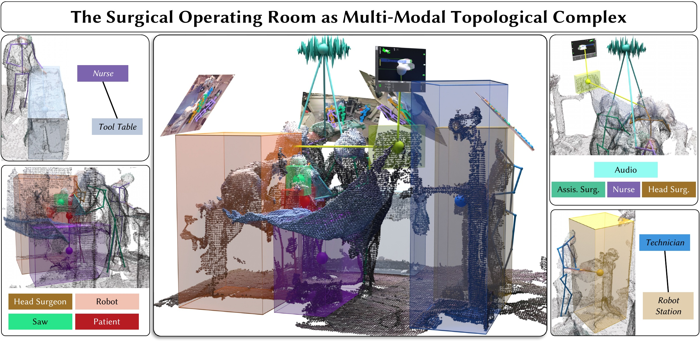

<h1 align="center">TopoOR</h1>

<p align="center">
  <b>A Unified Topological Scene Representation<br>for the Operating Room</b>
</p>

<p align="center">
  <a href="https://wngtn.github.io/">Tony Danjun Wang</a> &nbsp;·&nbsp;
  <a href="https://www.linkedin.com/in/ka-young-%E2%80%8Dkim-37605b263/">Ka Young Kim</a> &nbsp;·&nbsp;
  <a href="https://tolgabirdal.github.io/">Tolga Birdal</a> &nbsp;·&nbsp;
  <a href="https://www.professoren.tum.de/en/navab-nassir">Nassir Navab</a> &nbsp;·&nbsp;
  <a href="https://bastianlb.github.io/">Lennart Bastian</a>
</p>
<p align="center">
  <sub>Technical University of Munich &nbsp;·&nbsp; Munich Center for Machine Learning &nbsp;·&nbsp; Imperial College London &nbsp;·&nbsp; Kyung Hee University</sub>
</p>

<p align="center">
  <a href="#citation"></a>
  <a href="https://wngtn.github.io/TopoOR/"></a>
  <a href="https://drive.google.com/drive/folders/1ahroM7txAfQVjKTf_I33cyrcIeO8RWLd?usp=sharing"></a>
  <a href="#citation"></a>
</p>

<p align="center">
  
</p>

---

With **TopoOR** we propose a unified **higher-order topological representation** that captures group interactions among people, tools, and robots and integrates information from 3D geometry, audio, and robot sensors.

## Installation

Run all commands from the repository root. Install [uv](https://docs.astral.sh/uv/), then run:

```bash
uv sync --locked
```

## Data and weights

Request MM-OR through its [dataset download instructions](https://github.com/egeozsoy/MM-OR#mm-or-dataset),
then copy or symlink the downloaded `MM-OR_data/MM-OR_processed/` directory to
`data/mm_or/`.

Download the packed boxes, poses, embeddings, and released checkpoints:

```bash
bash scripts/download.sh
```

The packed modalities cover both training and evaluation; no preprocessing step is needed.
The script uses `uv` and `gdown` and skips existing nonempty files. For manual
downloads, copy `checkpoints/` and `data/` from the `TopoOR/` directory in the
[Google Drive folder](https://drive.google.com/drive/folders/1ahroM7txAfQVjKTf_I33cyrcIeO8RWLd?usp=sharing)
into the repository root.

<details>
<summary><b>Expected directory layout</b></summary>

```text
data/
├── mm_or/
│   ├── take_timestamp_to_next_action/<take>.json
│   ├── take_timestamp_to_robot_phase/<take>.json
│   ├── take_timestamp_to_sterility_breach/<take>.json
│   └── <take>/
│       ├── timestamp_to_pcd_and_frames_list.json   # ..._azure.json for 010_PKA
│       ├── camera{01..05}.json
│       ├── colorimage/camera{01..05}_colorimage-<frame>.jpg
│       ├── simstation/camera01_<frame>.jpg
│       └── relation_labels/<frame>.json
└── perception/
    ├── bounding_boxes.pkl
    ├── human_poses.pkl
    ├── audio_embeddings.pkl
    ├── text_embeddings.pkl
    └── json_embeddings.pkl

checkpoints/
├── workflow_recognition/
│   ├── hparams.yaml
│   └── checkpoints/latest_step_012000.ckpt
└── relation_prediction/
    ├── hparams.yaml
    └── checkpoints/latest_step_024000.ckpt
```

</details>

## Training

```bash
WANDB_MODE=offline .venv/bin/python src/train.py experiment=workflow_recognition
WANDB_MODE=offline .venv/bin/python src/train.py experiment=relation_prediction
```

Runs write to `logs/<experiment_name>/`. 

> [!WARNING]
> Due to the extremely limited dataset size, scores can vary with the environment.

## Evaluation

For **workflow recognition** (Next Action and Robot Phase), run:

```bash
.venv/bin/python src/eval.py --run checkpoints/workflow_recognition --output output/workflow_results.json
```

> [!NOTE]
> Robot Phase excludes `004_PKA` as that take contains annotation artifacts.

For **sterility breach detection**, run:

```bash
.venv/bin/python scripts/sterility_breach_eval.py
```


For **relation prediction**, run:

```bash
.venv/bin/python scripts/relation_prediction_eval.py --run checkpoints/relation_prediction --out output/relation_logits.npz
```

To evaluate a trained model, replace `--run checkpoints/...` with
`--run logs/<experiment_name>`. The evaluators load that run's configuration and
latest checkpoint.

## Citation

```bibtex
@inproceedings{wang2026topoor,
  author    = {Wang, Tony Danjun and Kim, Ka Young and Birdal, Tolga
               and Navab, Nassir and Bastian, Lennart},
  title     = {{TopoOR}: A Unified Topological Scene Representation
               for the Operating Room},
  booktitle = {Medical Image Computing and Computer Assisted Intervention -- MICCAI 2026},
  year      = {2026},
  publisher = {Springer Nature Switzerland},
  series    = {Lecture Notes in Computer Science},
  volume    = {16892},
  month     = sep,
  url       = {https://papers.miccai.org/miccai-2026/1068-Paper2412.html}
}
```

## License

[MIT](LICENSE).
